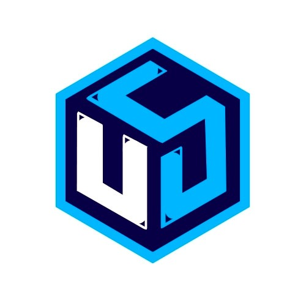

# 🤖 Engineus Group - Chatbot Automation Repository

Welcome to the official repository of **Engineus Group**, a Spanish startup specializing in cutting-edge chatbot solutions for businesses of all sizes.

## 🚀 About Us

Engineus Group is a forward-thinking startup based in Spain, dedicated to revolutionizing customer interaction through intelligent chatbot automation. We help businesses across various industries implement sophisticated conversational AI solutions that enhance customer experience and streamline operations.

## 📁 Repository Overview

This repository serves as our **open-source automation hub**, where we share innovative workflows and automation templates that showcase our expertise in chatbot development and business process automation.

### What You'll Find Here

- **WhatsApp Automation Templates**: Complete workflows for WhatsApp Business API integration
- **Chatbot Implementation Examples**: Real-world use cases and implementation patterns
- **Business Process Automation**: Workflows designed to optimize customer interactions
- **Integration Templates**: Ready-to-use templates for popular platforms and APIs

## 🎯 Current Content

### WhatsApp Typing Effect
Our latest addition demonstrates advanced WhatsApp Business API integration with typing indicators and automated responses. This template shows how to:
- Implement typing indicators for better user experience
- Handle incoming messages automatically
- Create natural conversation flows
- Integrate with Meta's WhatsApp Business API

## 🌟 What's Coming

This is just the beginning! We're committed to sharing more differential automations including:

- **Multi-platform Chatbot Templates** (Telegram, Discord, Slack)
- **Advanced AI Integration Workflows**
- **Customer Service Automation Patterns**
- **E-commerce Chatbot Solutions**
- **Lead Generation Automation**
- **Analytics and Reporting Templates**

## 🤝 Join Our Community

We believe in **100% transparency** and community-driven development. We're not here to take your money - we're here to share knowledge and build amazing solutions together.

### 🎮 Discord Community

Join our vibrant Discord community where automation enthusiasts, developers, and business owners come together to:

- **Share workflows and best practices**
- **Get real-time support from our team**
- **Collaborate on new automation ideas**
- **Learn from other community members**
- **Access exclusive templates and resources**

👉 **[Join our Discord Community](https://discord.gg/Z48HxJhwKR)**

## 💡 Our Philosophy

At Engineus Group, we believe that:
- **Knowledge should be shared freely**
- **Community collaboration drives innovation**
- **Transparency builds trust**
- **Everyone deserves access to powerful automation tools**

## 🛠️ Technology Stack

Our automations are built using:
- **n8n** - Powerful workflow automation platform
- **WhatsApp Business API** - Enterprise messaging solutions
- **Various AI/ML integrations** - For intelligent responses
- **Cloud platforms** - For scalability and reliability

## 📞 Get in Touch

- **Website**: [Coming Soon]
- **Email**: [Contact us through Discord]
- **Discord**: [Join our community](https://discord.gg/Z48HxJhwKR)

## 📄 License

This repository is open source and available under the MIT License. Feel free to use, modify, and distribute our templates for your own projects.

---

**Made with ❤️ by the Engineus Group team**

*Empowering businesses through intelligent automation* 